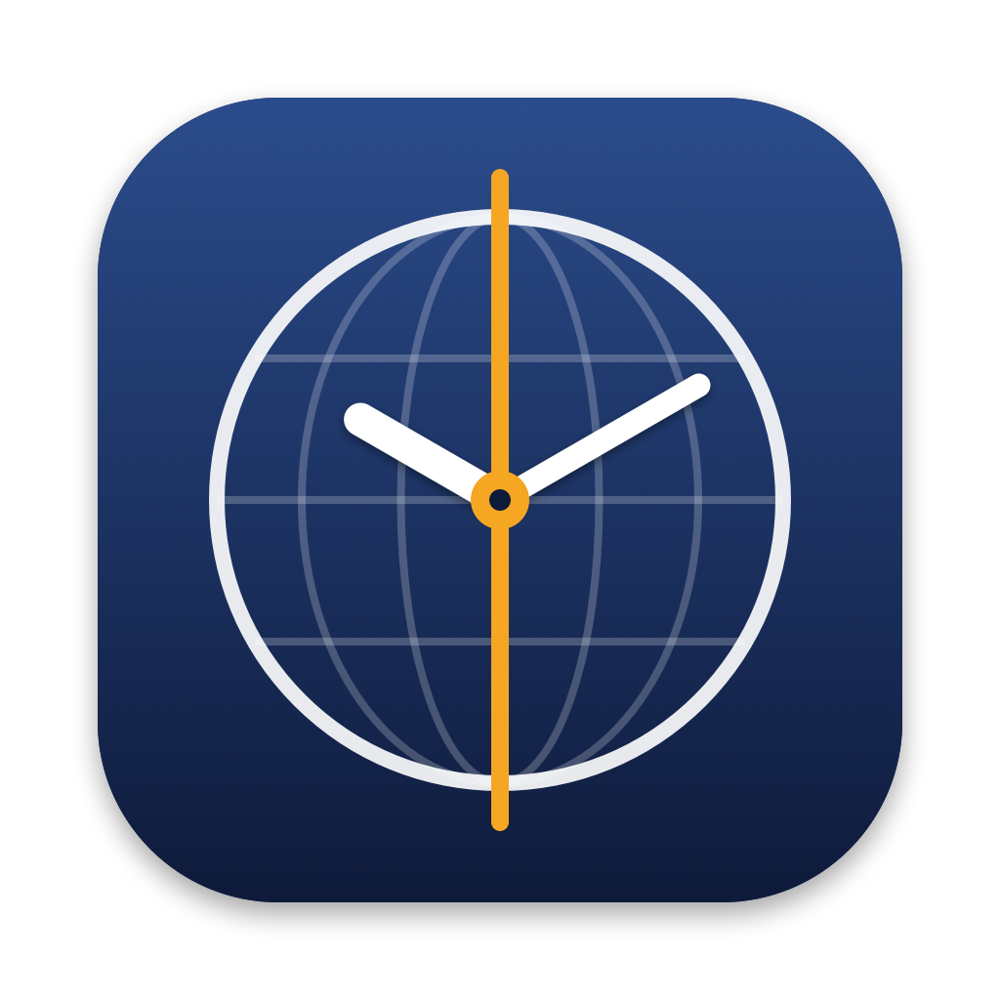
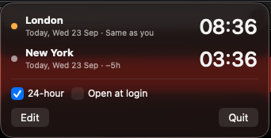

<p align="center">
  
</p>

# Meridian

A small macOS menu bar app that shows the time in several timezones at once. I built it because my team is split between London and New York, and I wanted to see both times at a glance.

```
LDN · Wed 23 · 08:43   │   NYC · Wed 23 · 03:43
```

Click it to see each city's full date, how far ahead or behind you it is, and whether it's a sensible time to message someone there.

<p align="center">
  
</p>

## ⚠️ Honesty note: this is vibe coded

I didn't write this app by hand. I described what I wanted to [Claude Code](https://claude.com/claude-code) (Anthropic's AI coding agent), and it wrote the code, the build script, the icon and this README. My part was to try it, send screenshots and say what to change.

What that means for you:

- **It's a personal tool, not a product.** It works on my Mac (macOS 26, Apple Silicon). There are no tests, and I haven't done a thorough code review.
- **Expect rough edges.** I haven't carefully checked the edge cases: unusual timezones, the days when the clocks change, 12-hour mode in other locales.
- **It isn't notarised.** It's only ad-hoc signed, so you have to build it yourself (see below). macOS may warn about it if you copy the built app to another Mac.
- **Read before you trust it.** It's only three short Swift files, so it's quick to read through. It makes no network requests and only stores settings in `UserDefaults`.

If that's fine with you, go ahead and use it, fork it or improve it.

## Features

- Any number of clocks. Each has a short label (`LDN`, `NYC`…) and can be shown in or hidden from the menu bar.
- The date in the menu bar can be set to **Always**, **If different** (only when a city's day isn't the same as yours) or **Never**.
- The panel shows "Today/Tomorrow/Yesterday", the full date and the difference from your time (e.g. `−5h`). Clock changes are handled by macOS's timezone data.
- A status dot shows whether someone is likely to be around: 🟢 9am–5pm on weekdays, 🟠 early or late (7–9am, 5–9pm), ⚪ out of hours or weekend.
- Search for and add any timezone by city or abbreviation (`Tokyo`, `PST`).
- 24-hour or 12-hour time, and an option to open at login.
- Updates exactly on the minute, and straight away after sleep or a clock or timezone change.
- No Dock icon.

## Build and install

You need macOS 14 or later and Xcode (or the Swift 6 command-line tools).

```sh
./build.sh            # builds build/Meridian.app
./build.sh --install  # also copies it to /Applications and launches it
```

Then click the clock in the menu bar and tick **Open at login** if you want it to start automatically.

To move it along the menu bar, hold **⌘** and drag it. macOS remembers the position.

## Project layout

```
Sources/Meridian/
  MeridianApp.swift   app entry point, MenuBarExtra, hides the Dock icon
  ClockStore.swift    saved clocks, minute timer, time/date formatting
  ClockPanel.swift    the dropdown panel UI and timezone picker
Resources/
  Info.plist          bundle metadata (LSUIElement = menu bar only)
  icon-1024.png       icon master; build.sh turns it into AppIcon.icns
scripts/
  make-icon.swift     draws the icon (swift scripts/make-icon.swift Resources/icon-1024.png)
build.sh              swift build, then puts together and ad-hoc signs the .app
```

## Licence

[MIT](LICENSE). Do what you like with it; no warranty (see the honesty note above).
